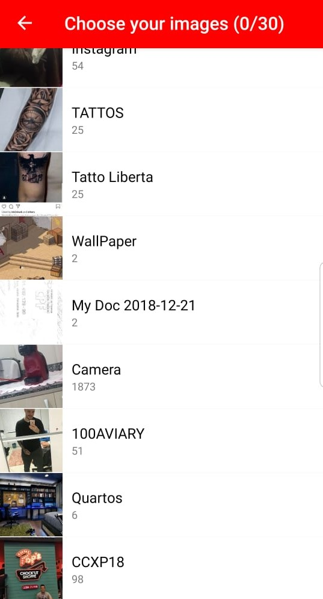
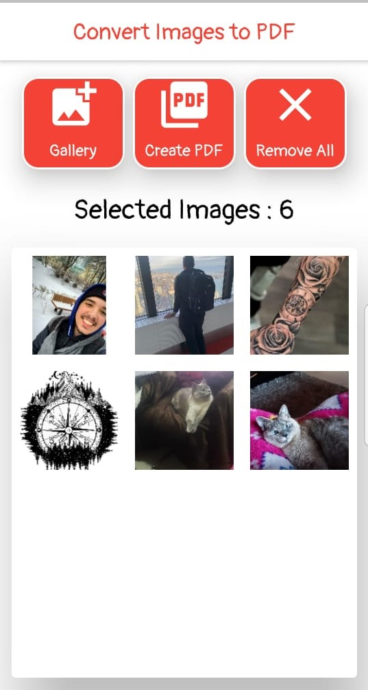
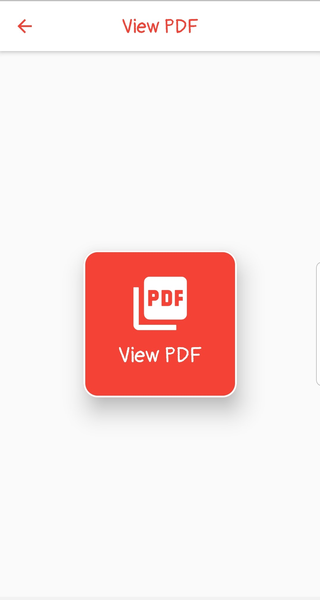

# Convert Images to a PDF File.

This project is an App with Flutter where you can select images from your gallery, convert all of them
to a PDF file and share it wherever you want.

## Packages used :

- [Multi Image Picker](https://pub.dev/packages/multi_image_picker)
- [Advance PDF Viewer](https://pub.dev/packages/advance_pdf_viewer)
- [Path Provider](https://pub.dev/packages/path_provider)
- [PDF](https://pub.dev/packages/pdf)
- [Flutter Absolute Path](https://pub.dev/packages/flutter_absolute_path)
- [Esys Flutter Share](https://pub.dev/packages/esys_flutter_share)

## Step By Step

- Create a List of Asset, and select all the images you want from the Multi Image Picker.
- Get the path from all this itens, with the Absolute Path.
- Create a PDF with the PDF package, and using a wrap widget, display all the images.
- To view the pdf just call the Advance PDF Viewer function, with the document as a parameter.
- To share the file wherever you want, use the Esys Flutter Share funcionality.

## Design

   
   
   

